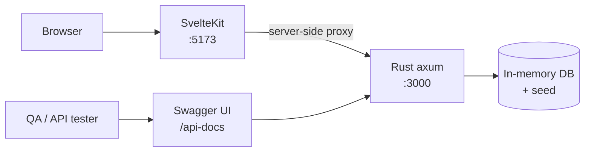
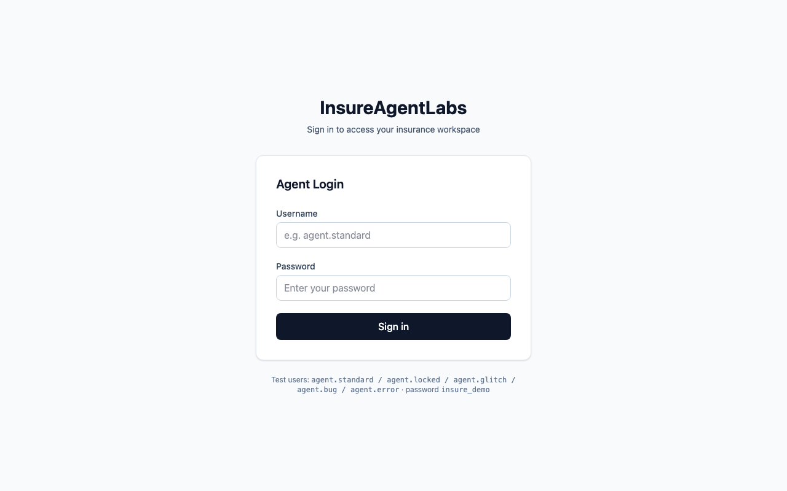
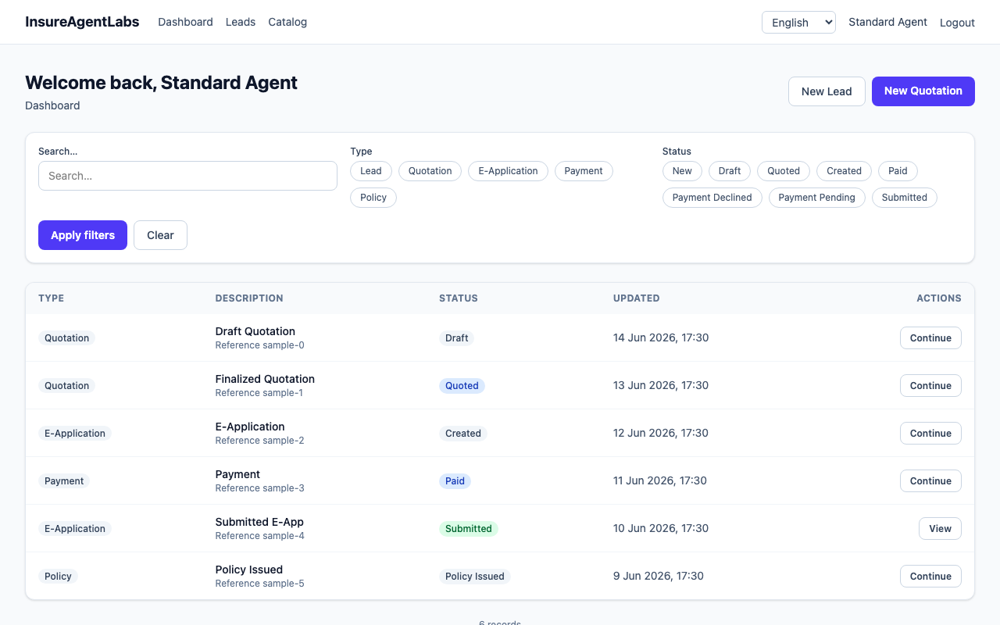
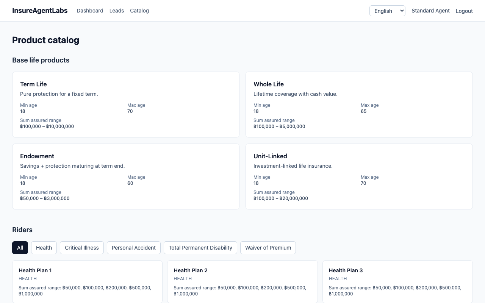
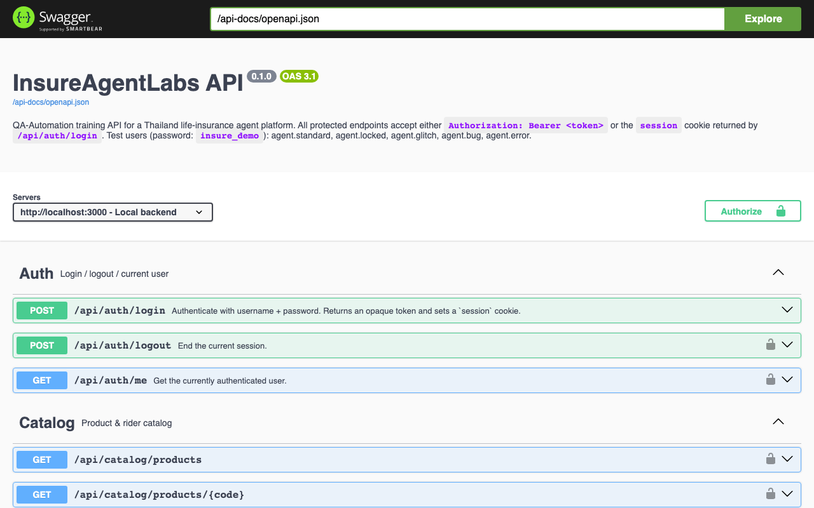

# InsureAgentLabs

A minimalist **QA Automation training** single-page application for a Thailand life-insurance agent platform, in the style of Swag Labs / SauceDemo.

Built for QA engineers to practice functional, API, and accessibility-based test automation against a realistic (but deterministic) insurance domain.

---

## Tech stack

| Layer | Technology |
|---|---|
| Backend | Rust 2024 · axum 0.8 · utoipa + utoipa-swagger-ui (Swagger at `/api-docs`) |
| Frontend | SvelteKit 5 (runes) · Tailwind CSS v4 · Paraglide (en/th i18n) |
| Persistence | In-memory (seeded) — `POST /api/admin/reset` restores the seed |
| Testing | Playwright (e2e) · Vitest (unit/browser) · Swagger UI (API) |

---

## Architecture



- The browser only talks to SvelteKit (server-side proxy).
- The Rust API is also directly exposed on `:3000` so API-QA trainees hit it via Swagger/curl.
- Session: HttpOnly cookie; forwarded as `Authorization: Bearer` to Rust.

---

## Screenshots

| Login | Dashboard |
|---|---|
|  |  |

| Product Catalog | Swagger API Docs |
|---|---|
|  |  |

---

## Quick start

### Prerequisites
- Rust toolchain (stable, edition 2024)
- Node 20+ and pnpm

### Run
```bash
# 1. Backend (terminal 1)
cd backend
cp .env.example .env
cargo run
# → http://localhost:3000  · Swagger: http://localhost:3000/api-docs

# 2. Frontend (terminal 2)
cd web
cp .env.example .env
pnpm install
pnpm dev
# → http://localhost:5173
```

### Test users
All passwords: `insure_demo`

| Username | Behavior |
|---|---|
| `agent.standard` | Happy path |
| `agent.locked` | Login returns 423 locked |
| `agent.glitch` | Artificial 3–5s delays |
| `agent.bug` | Premium defect, dead button, broken image |
| `agent.error` | 500 on finalize |

See [`docs/TEST-USERS.md`](docs/TEST-USERS.md) for details.

### Admin / QA tooling
All admin endpoints require either the `ADMIN_SECRET` header or a logged-in `agent.standard` session.

| Method | Path | Purpose |
|---|---|---|
| `POST` | `/api/admin/reset` | Reset DB to seed state (clears sessions) |
| `GET`  | `/api/admin/debug-state` | Counts of each collection + current scenario |
| `GET`  | `/api/admin/users` | List demo users (passwords redacted) |
| `GET`  | `/api/admin/users/{username}` | Fetch one demo user |
| `POST` | `/api/admin/seed-extra` | Seed an extra lead for test setup |

---

## Testing conventions

- Every interactive element, container, and error/status message has a unique `data-testid` — see [`docs/TESTIDS.md`](docs/TESTIDS.md).
- Pair testids with semantic ARIA roles (`role="alert"`, `role="status"`) for accessibility-based locators (Playwright `getByRole`).
- Bilingual UI (English / Thai), URL-prefixed (`/en`, `/th`).

---

## Requirements & roadmap

- [`docs/requirements/`](docs/requirements/README.md) — per-feature requirements specs (data model, API contract, business rules, acceptance criteria).
- [`docs/ROADMAP.md`](docs/ROADMAP.md) — build status and proposed future phases.
- [`docs/FINDINGS.md`](docs/FINDINGS.md) — defects surfaced by the blackbox suite.

---

## Deploy & test

- **Run the full stack:** `make up` (Docker Compose) → web at `http://localhost:5173`, backend at `http://localhost:3000`. See [`docs/DEPLOYMENT.md`](docs/DEPLOYMENT.md) for native, Compose, and Kubernetes (`deploy/k8s/`) workflows. `make help` lists all targets.
- **Blackbox tests:** [`e2e/`](e2e/README.md) is a standalone Playwright project with an `api` project (integration-level REST tests, hit the backend directly) and a `ui` project (browser e2e against the web app). Run `make e2e` against a running stack, or `make stack-e2e` to bring the stack up, test, and tear down.
- **CI:** [`.github/workflows/ci.yml`](.github/workflows/ci.yml) runs three jobs on every push/PR — backend (`clippy` + `cargo test`), web (`check` + `lint` + unit), and the blackbox suite against a freshly-built Compose stack (Playwright report uploaded as an artifact).

---

## Build plan & status

The implementation follows 9 phases tracked in repository memory:

| Phase | Description |
|---|---|
| 0 | Scaffolding & contracts ✅ |
| 1 | Auth slice ✅ |
| 2 | Catalog & Leads ✅ |
| 3 | Quotation ✅ |
| 4 | E-App & Payment ✅ |
| 5 | Dashboard ✅ |
| 6 | i18n + scenario polish ✅ |
| 7 | Admin & QA tooling ✅ |
| 8 | Fixtures & trainee docs ✅ |

---

## Development commands

```bash
# Backend
cd backend
cargo build
cargo clippy -- -D warnings
cargo test
cargo run

# Frontend
cd web
pnpm install
pnpm check          # svelte-check
pnpm lint           # prettier + eslint
pnpm format
pnpm test:unit      # vitest
pnpm exec playwright test
```
