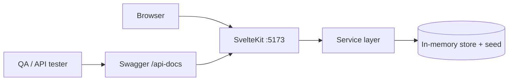

# InsureAgentLabs

A minimalist **QA Automation training** application for a Thailand life-insurance agent platform, in the style of Swag Labs / SauceDemo.

Built for QA engineers to practice functional, API, and accessibility-based test automation against a realistic (but **deterministic**) insurance domain. Five demo agents each trigger a reproducible behaviour — including intentional bugs — so test scenarios are repeatable.

This MVP covers the **quotation journey only**: log in → manage leads & packages → build a quotation (insured → plan/package + riders → coverage & premium) → produce a **Sales Illustration**.

---

## Tech stack

| Layer | Technology |
|---|---|
| App | **SvelteKit 5** (runes) · `adapter-node` · Tailwind CSS v4 |
| API | SvelteKit `+server.ts` routes under `/api` · zod validation · OpenAPI + Swagger UI at `/api-docs` |
| Persistence | In-memory (seeded) — `POST /api/admin/reset` restores the seed |
| Testing | Vitest (domain/service unit tests) · Playwright (blackbox API + UI) |

A single SvelteKit process serves the UI **and** the JSON API from the same origin — no separate backend, one container to deploy.

---

## Architecture



- Pages (`+page.server.ts`) and API routes (`/api/**/+server.ts`) both call the same **service layer** (`src/lib/server/services/*`) — one source of truth.
- Auth: HttpOnly session cookie for the browser; `Authorization: Bearer <token>` for API/QA.
- Domain logic (premium calc, validation) is isolated in `src/lib/server/domain/` and unit-tested.

---

## Quick start

### Prerequisites
- Node 20+ and pnpm

### Run
```bash
cd web
pnpm install
pnpm dev
# → http://localhost:5173   ·   Swagger: http://localhost:5173/api-docs
```

### Demo agents
All passwords: `insure_demo`

| Username | Behaviour |
|---|---|
| `agent.standard` | Happy path |
| `agent.locked` | Login returns **423 Locked** |
| `agent.glitch` | ~3–5s delay on premium **calculate** |
| `agent.bug` | Premium inflated ~5%, dead **Confirm** button, broken image |
| `agent.error` | **500** when creating the Sales Illustration |

See [`docs/TEST-USERS.md`](docs/TEST-USERS.md) for where each behaviour surfaces.

---

## API & QA tooling

- **Swagger UI:** `/api-docs` (OpenAPI JSON at `/api/openapi.json`). Log in via `POST /api/auth/login`, then use the returned token as a Bearer credential.
- **Reset:** `POST /api/admin/reset` restores the deterministic seed (open by design for automation).
- **Debug:** `GET /api/admin/debug-state` returns entity counts.

Error envelope (all endpoints): `{ "error": { "code", "message", "fields?": [{ "field", "message" }] } }`.

---

## Testing conventions

- Interactive elements carry stable `data-testid` attributes (e.g. `login-submit-button`, `confirm-illustration-button`).
- The API is the easiest QA surface — point integration tests at `/api/**` with a Bearer token.

---

## Deploy & test

- **Docker:** `make up` → app at `http://localhost:5173`. See [`docs/DEPLOYMENT.md`](docs/DEPLOYMENT.md) for Compose and Kubernetes (`deploy/k8s/`).
- **Unit tests:** `cd web && pnpm test` (Vitest: premium parity + full service flow + scenarios).
- **Blackbox tests:** [`e2e/`](e2e/README.md) — Playwright `api` + `ui` projects. `make e2e` against a running app, or `make stack-e2e` to build, test, and tear down.
- **CI:** [`.github/workflows/ci.yml`](.github/workflows/ci.yml) runs the web checks/build and the blackbox suite.

---

## Development commands

```bash
cd web
pnpm dev            # dev server
pnpm check          # svelte-check
pnpm lint           # prettier + eslint
pnpm test           # vitest (unit/service)
pnpm build          # production build (adapter-node → ./build)
```

> **Note:** state is in-memory and per-process — restarting the server (or a second pod) resets/diverges data. This is intentional for reproducible QA training; do not scale the deployment beyond one replica.
