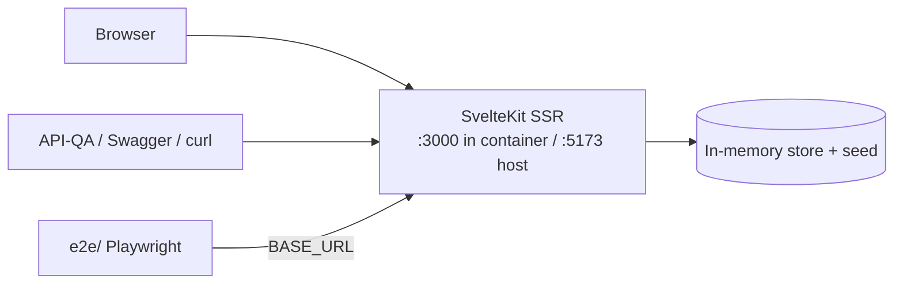

# Deployment & Development Workflow

InsureAgentLabs is a **single SvelteKit app** (`adapter-node`) that serves the UI and
the JSON API (`/api`, Swagger at `/api-docs`) from one process, backed by an in-memory
seeded store. This doc covers running it three ways (native, Docker, Kubernetes) and
running the blackbox suite against any of them.



A `Makefile` at the repo root wraps every workflow below — run `make help`.

---

## 1. Native development (fastest inner loop)

Requires Node 20+ with pnpm.

```bash
make dev            # = cd web && pnpm install && pnpm dev   → http://localhost:5173
```

Checks/tests: `make test` (svelte-check + vitest).

---

## 2. Docker (single image)

```bash
make up                    # docker compose up --build -d
#   app → http://localhost:5173   (Swagger: /api-docs)

make logs                  # tail
make reset                 # reset to seed state
make down                  # stop + remove
```

| Compose service | Host port | Container | Key env |
|---|---|---|---|
| `web` | `${WEB_PORT:-5173}` | `3000` | `ORIGIN` (browser-facing URL, for CSRF) |

Image: `insureagentlabs-web:latest` (multi-stage Dockerfile in `web/`).

> **State note:** the store is in-memory and per-process. Do not scale beyond 1
> replica — instances would not share state, and restarts reset to the seed.

---

## 3. Kubernetes (manifests in `deploy/k8s/`)

Plain manifests + a kustomization, suitable for a local `kind`/`minikube` cluster.

```bash
# 1. Build the image and load it into the cluster
make build
kind load docker-image insureagentlabs-web:latest
#   (minikube: `minikube image load insureagentlabs-web:latest`)

# 2. Apply
kubectl apply -k deploy/k8s

# 3. Reach the app
#    a) via Ingress host insureagentlabs.localtest.me (needs an ingress controller)
#    b) or port-forward:
kubectl -n insureagentlabs port-forward svc/web 5173:80
```

What's in the bundle:

| File | Contents |
|---|---|
| `namespace.yaml` | `insureagentlabs` namespace |
| `web.yaml` | Deployment (**1 replica** — in-memory state), Service `:80`, `/login` probes |
| `ingress.yaml` | Routes the host to `web` (UI + API on the same origin) |
| `kustomization.yaml` | Ties it together; pins the image tag |

`imagePullPolicy: IfNotPresent` so locally-built images are used without a registry.

---

## 4. Running the blackbox test suite

The [`e2e/`](../e2e/README.md) Playwright project tests a **running** app (API + UI)
and is environment-agnostic — point it via `BASE_URL`.

```bash
make e2e            # against http://localhost:5173
make e2e-api        # API/integration only
make e2e-ui         # UI/e2e only
make stack-e2e      # docker compose up → full suite → down

# against another environment:
BASE_URL=https://staging.example.com make e2e
```

[`.github/workflows/ci.yml`](../.github/workflows/ci.yml) runs the web checks/build
and the blackbox suite against a freshly-built container.

---

## Configuration reference

| Variable | Default | Purpose |
|---|---|---|
| `PORT` | `3000` | Listen port (in container) |
| `HOST` | `0.0.0.0` | adapter-node bind host |
| `ORIGIN` | `http://localhost:5173` | **Required for adapter-node**: public browser-facing URL. Form POSTs (login, etc.) are CSRF-rejected (403) if this doesn't match the origin the browser uses. |
| `BASE_URL` | `http://localhost:5173` | e2e suite target |
