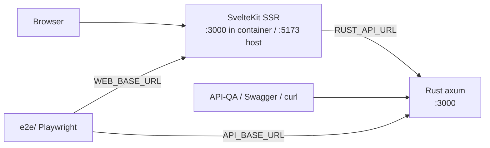

# Deployment & Development Workflow

InsureAgentLabs is a two-service app — a Rust/axum **backend** (in-memory, seeded)
and a SvelteKit **web** front end (SSR, talks to the backend server-side). This doc
covers running it three ways (native, Docker Compose, Kubernetes) and how to run the
blackbox test suite against any of them.



A `Makefile` at the repo root wraps every workflow below — run `make help`.

---

## 1. Native development (fastest inner loop)

Requires a Rust toolchain (edition 2024 / rustc ≥ 1.85) and Node 20+ with pnpm.

```bash
# terminal 1 — backend on :3000 (Swagger at /api-docs)
make dev-backend          # = cd backend && cargo run

# terminal 2 — web on :5173
make dev-web              # = cd web && pnpm install && pnpm dev
```

Env files are auto-copied from `.env.example` on first run. Defaults:
backend `:3000`, web `:5173`, `RUST_API_URL=http://localhost:3000`.

Checks/tests: `make test-backend` (clippy + cargo test), `make test-web` (vitest).

---

## 2. Docker Compose (full stack)

The recommended way to run a production-like stack locally or in CI. Both services
are multi-stage builds; healthchecks gate `web` on a healthy `backend`.

```bash
cp .env.example .env       # optional — tune ports / ADMIN_SECRET
make up                    # docker compose up --build -d
#   web      → http://localhost:5173
#   backend  → http://localhost:3000   (Swagger: /api-docs)

make logs                  # tail
make reset                 # reset backend to seed state (agent.standard session)
make down                  # stop + remove
```

| Compose service | Host port | Container | Key env |
|---|---|---|---|
| `backend` | `${BACKEND_PORT:-3000}` | `3000` | `ADMIN_SECRET`, `CORS_ORIGIN`, `RUST_LOG` |
| `web` | `${WEB_PORT:-5173}` | `3000` | `RUST_API_URL=http://backend:3000` |

Images: `insureagentlabs-backend:latest`, `insureagentlabs-web:latest`
(Dockerfiles live in `backend/` and `web/`).

> **State note:** the backend store is in-memory and per-process. Do not scale the
> `backend` service beyond 1 replica — instances would not share state.

---

## 3. Kubernetes (manifests in `deploy/k8s/`)

Plain manifests + a kustomization, suitable for a local `kind`/`minikube` cluster.

```bash
# 1. Build images and load them into the cluster
make build
kind load docker-image insureagentlabs-backend:latest insureagentlabs-web:latest
#   (minikube: `minikube image load <image>` for each)

# 2. Apply
kubectl apply -k deploy/k8s

# 3. Reach the app
#    a) via Ingress host insureagentlabs.localtest.me (needs an ingress controller)
#    b) or port-forward:
kubectl -n insureagentlabs port-forward svc/web 5173:80
kubectl -n insureagentlabs port-forward svc/backend 3000:3000   # Swagger/API-QA
```

What's in the bundle:

| File | Contents |
|---|---|
| `namespace.yaml` | `insureagentlabs` namespace |
| `backend.yaml` | Deployment (1 replica), Service `:3000`, `ADMIN_SECRET` Secret, `/api/health` probes |
| `web.yaml` | Deployment (2 replicas), Service `:80`, `RUST_API_URL` → in-cluster backend, `/login` probes |
| `ingress.yaml` | Routes the host to `web` (backend stays cluster-internal) |
| `kustomization.yaml` | Ties it together; pins image tags |

`imagePullPolicy: IfNotPresent` so locally-built images are used without a registry.
For a real registry, retag/push and set the images via the kustomization.

---

## 4. Running the blackbox test suite

The [`e2e/`](../e2e/README.md) Playwright project tests a **running** stack (API +
UI) and is environment-agnostic — point it wherever via `API_BASE_URL` /
`WEB_BASE_URL`.

```bash
make e2e            # against http://localhost:3000 + :5173 (compose / native)
make e2e-api        # API/integration only
make e2e-ui         # UI/e2e only
make stack-e2e      # compose up → full suite → compose down

# against another environment:
API_BASE_URL=https://api.staging.example.com \
WEB_BASE_URL=https://staging.example.com \
make e2e
```

A typical CI job: `make up` → `make e2e` → `make down` (or just `make stack-e2e`).
This is exactly what [`.github/workflows/ci.yml`](../.github/workflows/ci.yml) does
in the `e2e` job — it builds the images, brings up the Compose stack, runs the
blackbox suite, and uploads the Playwright report as an artifact (alongside
separate `backend` and `web` check jobs).

---

## Configuration reference

| Variable | Service | Default | Purpose |
|---|---|---|---|
| `PORT` | backend, web | `3000` | Listen port (in container) |
| `RUST_LOG` | backend | `info` | Log level |
| `ADMIN_SECRET` | backend | `dev-admin-secret` | Admin guard secret (see note below) |
| `CORS_ORIGIN` | backend | `http://localhost:5173` | Allowed browser origin (also always allows `http://localhost*`) |
| `RUST_API_URL` | web | `http://localhost:3000` | Backend base URL for SSR calls |
| `HOST` | web | `0.0.0.0` | adapter-node bind host |
| `ORIGIN` | web | `http://localhost:5173` | **Required for adapter-node**: public browser-facing URL. Form POSTs (login, etc.) are CSRF-rejected (403) if this doesn't match the origin the browser uses. |
| `API_BASE_URL` / `WEB_BASE_URL` | e2e | `:3000` / `:5173` | Suite targets |

> **`ADMIN_SECRET` caveat:** the admin guard accepts either the secret or an
> `agent.standard` session, but the current handlers only check the session — the
> header path isn't wired in yet. In practice, admin/reset works via an
> `agent.standard` login (what `make reset` and the e2e suite use). See
> [`requirements/08-admin-qa-tooling.md`](requirements/08-admin-qa-tooling.md).
